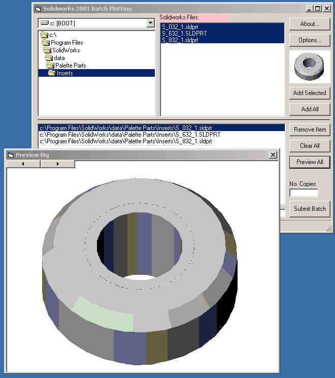



## SolidWorks Viewer/Plotter

### Description

Batch viewing/ and plotting of Solidworks files. This is also extended to view word, excel, txt and picture files. Many more features is added in future. Take care,yall...
 
### More Info
 
* Registered solidworks only.

* SW 2001/SP11

* VB 6 SP5

* Windows 2k tested only.

* You may wish to incorporate some more functionality. Replace the PrintDirect statement with a PrintOut2. Also, the asm file view need to be zoomed-to-fit.

*Autocad functionality can also be added.

*Printing of the picture and other file types need OLE invoking of their respective parent type. I will include in the next version.

Many thanks to many of the PSC coders whose help has been immensely useful

None... try at your own risk.

             |
---                |---
**Submitted On**   |2001-10-23 14:08:20
**By**             |[Bubba 1947](https://github.com/Planet-Source-Code/PSCIndex/blob/master/ByAuthor/bubba-1947.md)
**Level**          |Beginner
**User Rating**    |5.0 (20 globes from 4 users)
**Compatibility**  |VB 6\.0
**Category**       |[Miscellaneous](https://github.com/Planet-Source-Code/PSCIndex/blob/master/ByCategory/miscellaneous__1-1.md)
**World**          |[Visual Basic](https://github.com/Planet-Source-Code/PSCIndex/blob/master/ByWorld/visual-basic.md)
**Archive File**   |[SolidWorks3069010232001\.zip](https://github.com/Planet-Source-Code/bubba-1947-solidworks-viewer-plotter__1-28361/archive/master.zip)

### API Declarations

Please check code.

